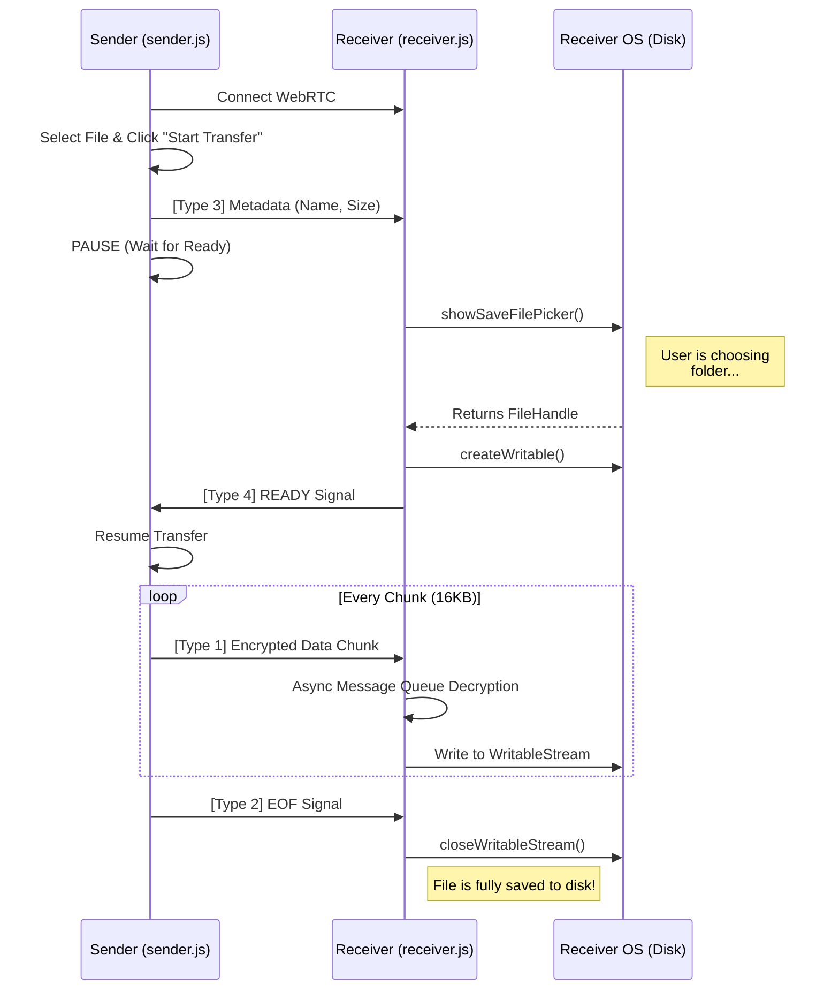

# Lemon Drop: File System Access Architecture

## 1. The Goal
To securely and efficiently transfer massive files (10GB+) directly from peer to peer over WebRTC, saving the file to the receiver's disk using the **File System Access API**. This bypasses memory limits and avoids the UX friction of invisible OPFS storage by letting the user pick their exact save location upfront.

## 2. The Core Challenge
If the sender starts blasting file chunks over WebRTC before the receiver has selected a save destination, the receiver's browser will attempt to buffer the chunks in RAM, leading to an immediate Out-Of-Memory (OOM) crash. 

## 3. The Solution: The "Ready Handshake"
To prevent memory crashes and ensure strict synchronization, the transfer will be governed by a bi-directional handshake mechanism.

### Flow Breakdown:

#### A. Initial Connection
1. Sender creates the room and waits. Sender's file input is **disabled/hidden**.
2. Receiver joins the room.
3. WebRTC connection establishes. Sender's UI unlocks and displays the file drop zone.

#### B. The Handshake
1. Sender selects a file. A "Start Transfer" button appears.
2. Sender clicks "Start Transfer".
3. `sender.js` sends a **Metadata Packet** (`type: 3`) containing the filename and size. **The sender then PAUSES** and waits.
4. `receiver.js` receives the Metadata Packet. It triggers the `showSaveFilePicker()` API, opening the OS-native "Save As..." dialog for the user.
5. The Sender's UI displays: *"Waiting for receiver to accept the file..."*
6. The Receiver's user selects a destination folder. `receiver.js` creates a `writableStream` directly to that file on disk.
7. `receiver.js` sends a **Ready Packet** (`type: 4`) back to the Sender. (If the user hits Cancel, it sends a **Reject Packet** (`type: 5`)).

#### C. The Transfer
1. `sender.js` receives the Ready Packet and begins slicing, encrypting, and sending the file chunks (`type: 1`).
2. `receiver.js` receives chunks, decrypts them, and pipes them directly into the `writableStream`.
3. To handle concurrent decryption without sequence mismatches, `receiver.js` uses an **Asynchronous Message Queue** to process chunks sequentially.
4. Once the file is fully sent, `sender.js` sends an **EOF Packet** (`type: 2`).
5. `receiver.js` closes the `writableStream`. The file is instantly ready on the receiver's hard drive.

## 4. Sequence Diagram

## 5. Fallback Strategy
The `showSaveFilePicker` API is supported in Chrome, Edge, and Opera, but is currently not supported in Safari or mobile browsers (iOS/Android). 
If `window.showSaveFilePicker` is undefined, `receiver.js` will automatically fallback to the OPFS (Origin Private File System) approach. It will instantly send the Ready Packet, stream the file to the hidden OPFS sandbox, and present a visible "Save File" button at the end of the transfer.
